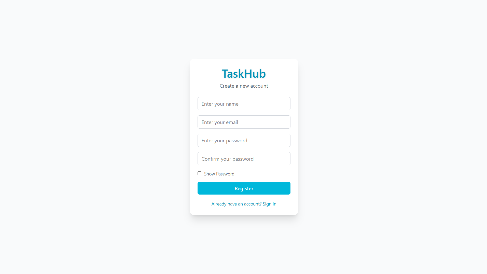
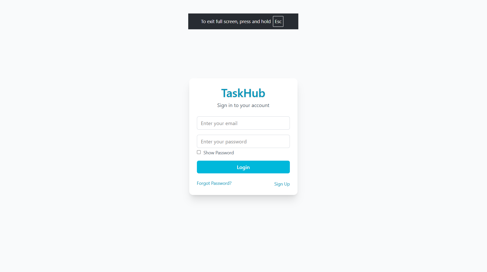
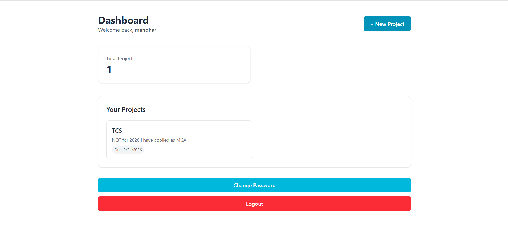
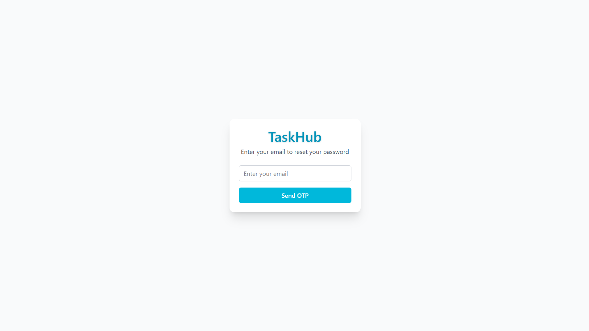
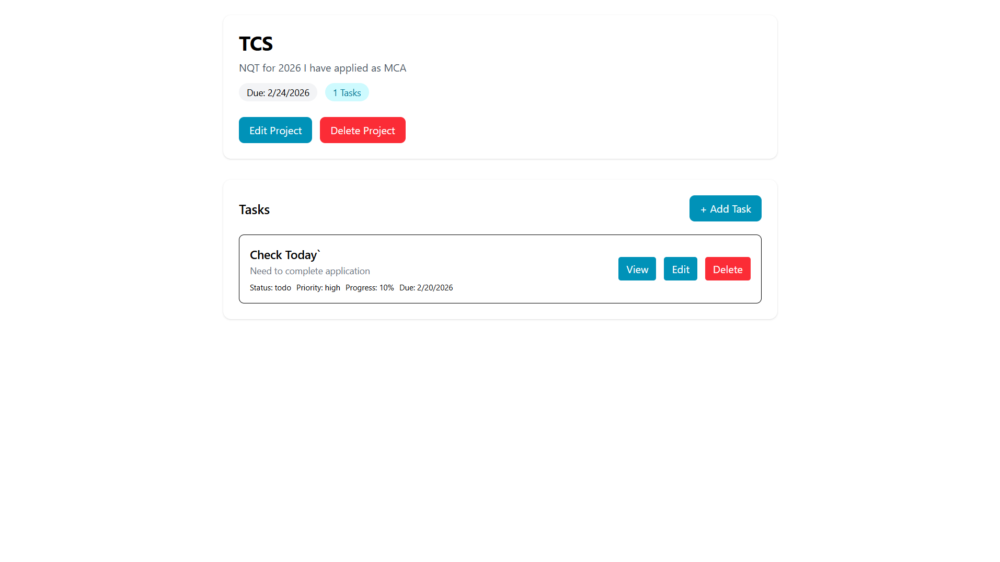
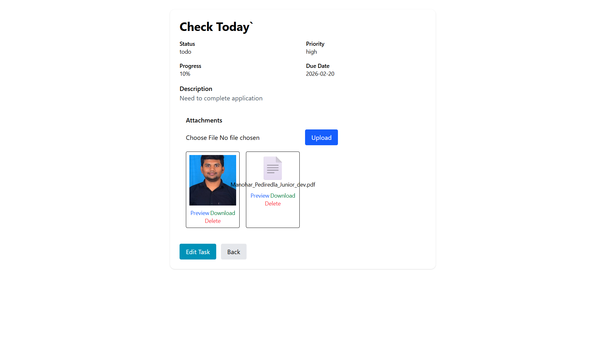

# 🚀 TaskHub (V1) — MERN Task & Project Management System

TaskHub is a production-ready MERN stack task & project management application that helps users organize projects and tasks with secure email OTP authentication and file attachment support (images & PDFs).

V1 focuses on simplicity, security, and clean modular architecture for a single-user workflow.

---

## 🌐 Live Demo

Frontend: https://taskub.netlify.app  
Backend: https://taskhub-backend.onrender.com

---

## 🛠 Tech Stack

### Frontend

- React.js (Vite)
- Tailwind CSS
- Axios

### Backend

- Node.js
- Express.js

### Database

- MongoDB Atlas
- Mongoose

### Authentication & Security

- JWT Authentication
- Email OTP Verification (Brevo / Sendinblue)
- bcrypt Password Hashing
- CORS
- Rate Limiting

### File Storage

- Local Uploads (Development)
- AWS S3 (Production)

### Tools

- Git
- GitHub
- Postman

---

## ✨ Features (V1)

### 🔐 Authentication

- Register with email & password
- Email OTP verification for successful registration
- Login with email & password
- Forgot password & reset via OTP
- JWT-based authentication (stored in sessionStorage)

### 📁 Projects

- Create, update, delete projects
- Project fields: Title, Description, Due Date

### ✅ Tasks

- Create, update, delete tasks inside projects
- Task fields: Title, Description, Status, Priority, Due Date, Progress (1–100)
- View task details

### 📎 Attachments

- Upload image / PDF inside task
- Files stored in AWS S3 (production)
- Preview uploaded files

### 🛡 Security

- OTP expiry handling
- Password hashing
- Basic API rate limiting

---

## 🧭 How to Use (V1 Flow)

1. Open site
2. Register using email & password
3. Verify email using OTP (sent via Brevo)
4. Login
5. Create a Project
6. Open Project → Add Tasks
7. View / Edit / Delete Tasks
8. Upload attachments inside task
9. Logout when finished

---

## ⚠ Known Limitations (V1)

- Token stored in sessionStorage
- User cannot access Login page again until Logout
- Navigation back to dashboard from project details is limited
- Minimal loading indicators
- Page refresh may show 404 due to SPA routing (Netlify)

These will be improved in future versions.

---

## 📁 Repository Structure

/backend  
/frontend  
/docs

---

## 📸 Screenshots

Create folder:

screenshots/

  

---

## 🔧 Quick Local Setup

### Prerequisites

- Node.js 18+
- npm
- MongoDB Atlas
- (Optional) AWS S3 bucket

---

## 🖥 Backend Setup

cd backend  
cp .env.example .env  
npm install  
npm run dev

or

npm start

### Sample Backend .env

PORT=5000  
MONGO_URI=your_mongodb_url  
JWT_SECRET=your_secret_key

EMAIL_HOST=your_smtp_host  
EMAIL_USER=your_email  
EMAIL_PASS=your_email_password

AWS_ACCESS_KEY_ID=your_key  
AWS_SECRET_ACCESS_KEY=your_secret  
AWS_BUCKET_NAME=your_bucket  
AWS_REGION=your_region

---

## 🖥 Frontend Setup

cd frontend  
cp .env.example .env  
npm install  
npm run dev

### Frontend .env

VITE_API_URL=http://localhost:5000

Build:

npm run build

---

## 🚀 Deployment

### Backend (Render / Railway)

- Add environment variables
- Set NODE_ENV=production

### Frontend (Netlify / Vercel)

- Set VITE_API_URL to backend public URL

---

## 👨‍💻 Author

Manohar Pediredla  
Junior Software Engineer | MERN Stack Developer  
Email: manoharpediredla2@gmail.com  
LinkedIn: https://linkedin.com/in/manoharpediredla

---

## ⭐ Why This Project Matters

- Demonstrates full-stack MERN development
- Secure authentication with OTP
- RESTful API design
- File upload pipeline with AWS S3
- Real-world deployment experience

---

## 📄 License

@Manohar_Pediredla
